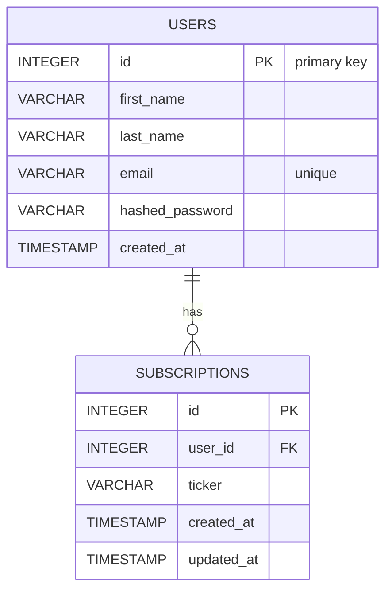

# Data Model

This document sketches the data model for the project and shows relationships between the main entities: Users and Subscriptions.

## Mermaid ER Diagram

## Explanation

- Users

  - `id`: primary key (autoincrement integer)
  - `first_name`, `last_name`: short strings
  - `email`: unique identifier used for login
  - `hashed_password`: bcrypt hash (stored in DB column `hashed_password`)
  - `created_at`: timestamp when the user was created

- Subscriptions
  - `id`: primary key
  - `user_id`: foreign key referencing `users.id`
  - `ticker`: financial instrument identifier (e.g., "AAPL")
  - `created_at`, `updated_at`: tracking timestamps

## Where the code lives

- User model: `app/db/models/user.py`
- Subscription model: `app/db/models/subscription.py`

---

## Rendered diagram

If your markdown renderer does not process Mermaid, a rendered SVG is included below:

